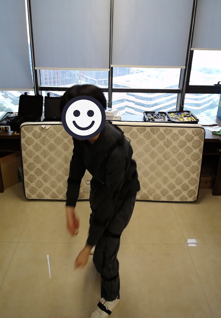
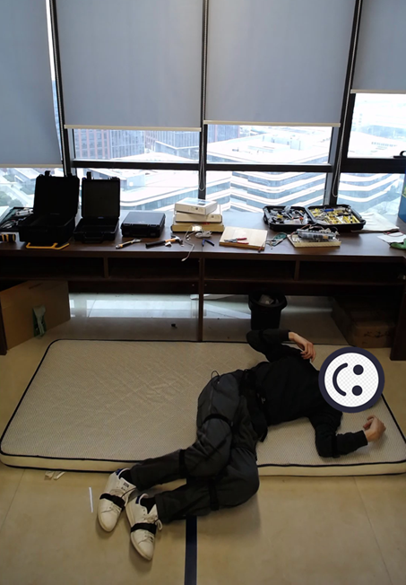
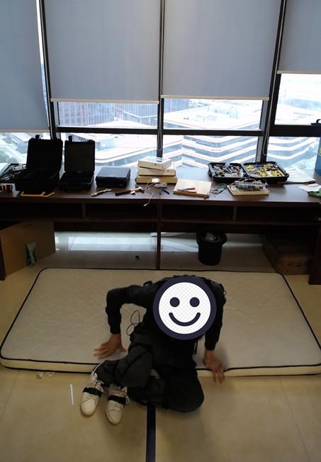
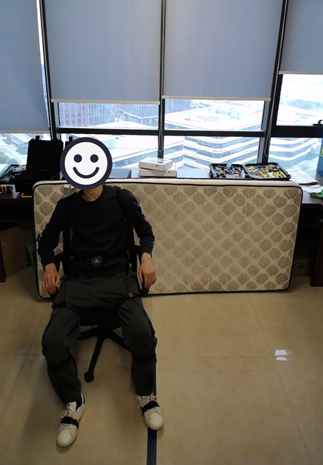
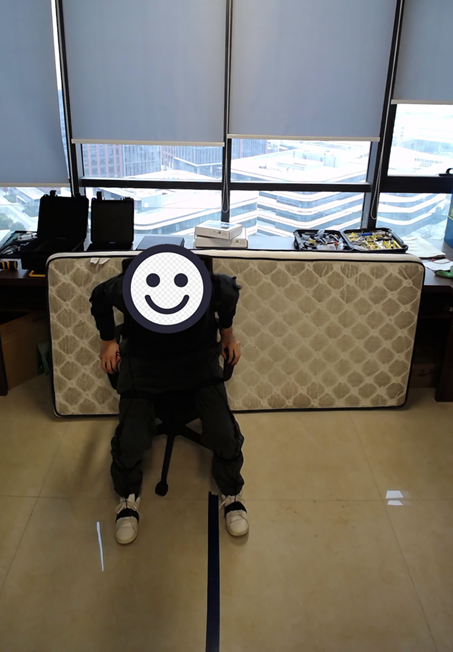
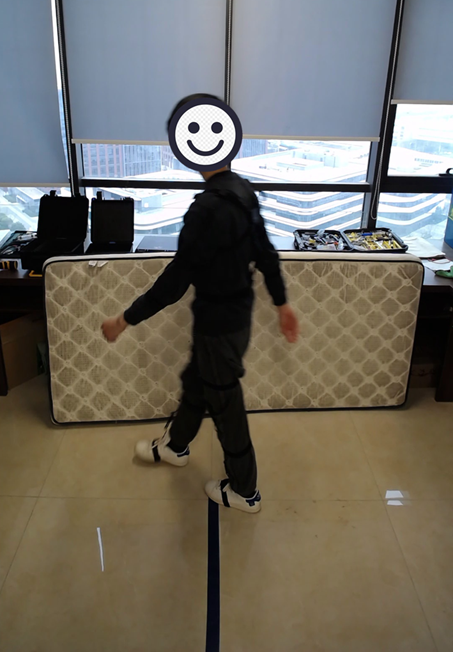
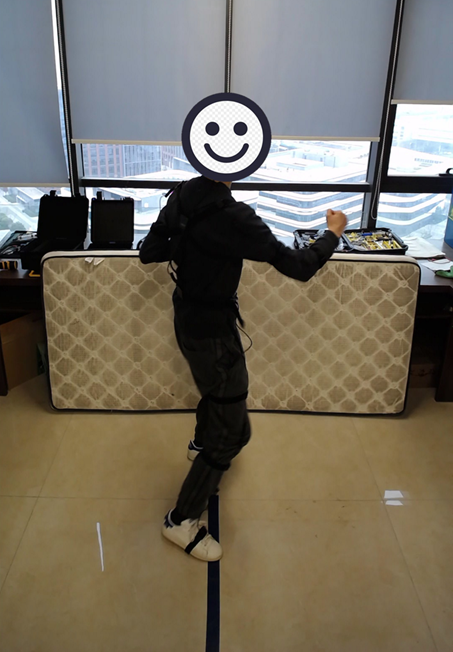
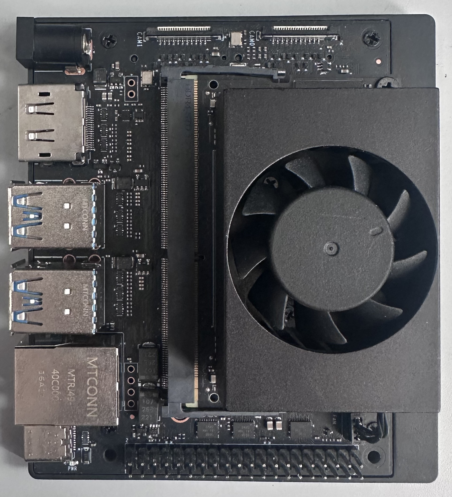

# Anonymous Repository for ACM SenSys 2026 Submission
# CDPose: A Large-Scale Millimeter-Wave Radar Dataset for 3D Human Pose Estimation

This repository contains the **anonymized dataset, and source code** for our submission to *ACM SenSys 2026*.  
All materials are provided **solely for double-blind review** and will be publicly released after acceptance.

---

## 1. Overview

This dataset supports research in **3D human pose reconstruction** from **millimeter-wave radar point clouds**. It provides high-resolution, time-aligned ground-truth **3D joint annotations** using a synchronized **motion capture system**.

**Summary (current subset):**
- **Subjects:** 29 participants
- **Frames:** 474k+ radar point-cloud frames
- **Labels:** 23 body keypoints with 3D coordinates (meters)
- **Modality:** mmWave radar + Inertial Measurement Units
- **Primary Task:** Single-person 3D pose estimation from RF signals

> ⚠️ At submission time, only an **anonymized and truncated subset** is included; full release will follow after acceptance.

---

## 2. Repository Structure


---

## 3. Dataset

### 3.1 Contents
Each data sample in this dataset represents **time-aligned radar–motion capture pairs**.  
All data have been synchronized and cleaned for reproducibility.

- **Radar point cloud sequence**  
  Stored in a `.pkl` file as a nested Python list:  
  `list[frame][ndarray]`, where each array corresponds to a radar frame.  
  The array shape is `(num_points, 5)`, representing the following fields:

<div align="center">

| **Dimension** | **Description** |
|:--------------:|:---------------:|
| **x** | X coordinate (meters) |
| **y** | Y coordinate (meters) |
| **z** | Z coordinate (meters) |
| **velocity** | Radial velocity (m/s) |
| **power** | Signal power |

</div>

  This structure preserves the variable number of radar points per frame.

- **Ground-truth keypoints**  
  Provided as a `.npy` file with shape `(num_frames, 23, 3)`.  
  Each entry corresponds to the **3D coordinates (in meters)** of 23 human body joints.  
  The keypoints are strictly time-aligned with radar frames.

> ✅ The dataset provides **pre-aligned** radar and motion-capture data for each frame.  
> No additional synchronization or calibration is required during use.

---

#### Example Loading Snippet (Python)

```python
import pickle
import numpy as np

# Load radar data
with open('file_name.pkl', 'rb') as f:
    radar_data = pickle.load(f)   # list[frame][ndarray(num_points, 5)]

# Load ground-truth keypoints
imu_data = np.load('file_name.npy')  # shape: (num_frames, 23, 3)
```

### 3.2 Data Collection Summary
Data were collected from 29 human subjects (19 males and 10 females) spanning diverse ages (19–55 years), heights (157–184 cm), and body weights (47–84 kg) to ensure variability in body size and motion patterns.

The dataset includes a set of motion categories: bend over, crouch down, fall down, get up, sit down, stand up, throw punches, walk around, and wave hands.Participants were given only high-level verbal prompts for each action to preserve natural movement diversity.

Recordings took place across three indoor environments. Since mmWave radar signals are insensitive to static backgrounds, data from all scenes were merged into a unified dataset without distinguishing scene-specific variations.

#### Example Motion
<div align="center">

<table>
  <tr>
    <td align="center" valign="top" style="padding:6px;">
      <br/>
      <sub><b>(a)</b> bend over</sub>
    </td>
    <td align="center" valign="top" style="padding:6px;">
      <br/>
      <sub><b>(b)</b> fall down</sub>
    </td>
    <td align="center" valign="top" style="padding:6px;">
      <br/>
      <sub><b>(c)</b> get up</sub>
    </td>
    <td align="center" valign="top" style="padding:6px;">
      <br/>
      <sub><b>(d)</b> sit down</sub>
    </td>
  </tr>

  <tr>
    <td align="center" valign="top" style="padding:6px;">
      <br/>
      <sub><b>(e)</b> bend over</sub>
    </td>
    <td align="center" valign="top" style="padding:6px;">
      <br/>
      <sub><b>(f)</b> fall down</sub>
    </td>
    <td align="center" valign="top" style="padding:6px;">
      <br/>
      <sub><b>(g)</b> get up</sub>
    </td>
    <td align="center" valign="top" style="padding:6px;">
      <br/>
      <sub><b>(h)</b> sit down</sub>
    </td>
  </tr>

  <tr>
    <td align="center" valign="top" style="padding:6px;">
      <br/>
      <sub><b>(i)</b> get up</sub>
    </td>
    <td align="center" valign="top" style="padding:6px;">
      <br/>
      <sub><b>(j)</b> walk around</sub>
    </td>
    <td align="center" valign="top" style="padding:6px;">
      <br/>
      <sub><b>(k)</b> wave hands</sub>
    </td>
    <td align="center" valign="top" style="padding:6px;">
      <br/>
      <sub><b>(l)</b> throw punches</sub>
    </td>
  </tr>

  <tr>
    <td align="center" valign="top" style="padding:6px;">
      <br/>
      <sub><b>(m)</b> get up</sub>
    </td>
    <td align="center" valign="top" style="padding:6px;">
      <br/>
      <sub><b>(n)</b> walk around</sub>
    </td>
    <td align="center" valign="top" style="padding:6px;">
      <br/>
      <sub><b>(o)</b> wave hands</sub>
    </td>
    <td align="center" valign="top" style="padding:6px;">
      <br/>
      <sub><b>(p)</b> throw punches</sub>
    </td>
  </tr>
</table>

</div>

### 3.3 System Setup
Our data acquisition setup employs a **60 GHz mmWave radar module** .
The module operates within the **57–65 GHz** frequency band and adopts a **4T4R antenna configuration**, as illustrated in the figure below.
This design enables a wide **field of view (FOV)** of approximately **140° (azimuth)** and **70° (elevation)**, allowing comprehensive coverage of human motions.

To obtain **ground-truth motion data**, we employ a **VDSuit-Full** inertial motion capture system, which provides precise **3D joint positions** through a network of **Inertial Measurement Units (IMUs)**.
The system outputs **23 anatomical keypoints** forming a full-body skeletal model, which are used as **supervised learning labels** for radar-based pose estimation.

<div align="center"> <table> <tr> <td align="center"> <br/> Data Collection System Overview </td> </tr> </table> </div>


---

## 4. On-Device Deployment and Performance
To validate the **practical deployability** of models trained on **CDPose** in real-world scenarios such as *in-home healthcare* and *smart environments*, we evaluated their performance on a representative low-power embedded AI platform — the **NVIDIA Jetson Orin Nano**.

#### Testbed Specifications
The Jetson Orin Nano is equipped with a **512-core Ampere GPU** and **8 GB of memory**, capable of up to **40 TOPS (INT8)** of AI performance within a constrained **15 W power envelope**.
This makes it an ideal edge computing platform for energy-efficient radar-based sensing.

#### Hardware Setup Illustration

The following image shows the embedded inference platform used in our experiments — an **NVIDIA Jetson Nano (8 GB)** development board configured for real-time radar-based pose estimation.

<div align="center"> <table> <tr> <td align="center"> <br/> NVIDIA Jetson Nano Development Board </td> </tr> </table> </div>

#### On-Device Performance Summary

<div align="center">

| **Metric** | **Value** |
|:-----------:|:---------:|
| **Model Inference Time*** | **6 ms** |
| **System Power Consumption** | **6.4 W** |
| **GPU Usage** | **15%** |
| **CPU Usage (6-core Avg)** | **28.8%** |
| **RAM Usage** | **52.6%** |

</div>

<sub>*Average per-frame inference time measured over 1000 frames.</sub>

The results demonstrate **exceptional runtime efficiency**.
The model achieves an **average inference time of only 6 ms per frame**, confirming its capability for **real-time radar sensing** — the computation delay is negligible compared to the data acquisition rate.

Moreover, this high-speed inference operates within a **minimal power budget**:
the system consumes only **6.4 W total**, with moderate utilization of computational resources (15% GPU, 28.8% CPU).
These metrics highlight the platform’s suitability for **always-on sensing** and **continuous monitoring applications**.

#### Deployment Demonstration Video

<div align="center">
<video src="video_demo/unity_demo.mp4" width="80%" controls muted loop></video><br/>
<sub><b>Demo:</b> Real-time inference on NVIDIA Jetson Orin Nano using TensorRT optimization. The visualization is based on 23 keypoints estimated by PointNet++, which are further reconstructed and rendered in Unity 3D for better visual presentation.</sub>
</div>

Note that due to differences in coordinate system conventions, the radar point clouds appear as a mirror reflection relative to the image and keypoint results.

---


## 5. Citation
To preserve anonymity, the citation will be added after acceptance.

---

## 6. Contact
To preserve anonymity, the contact will be added after acceptance.
